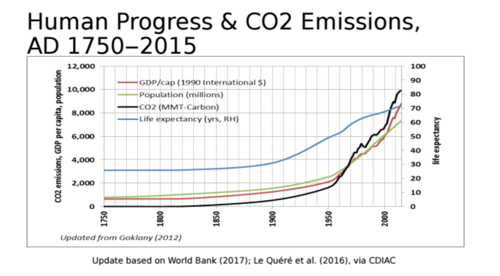

```{r setup, include=FALSE}
library(tidyverse)
library(sds192)
library(RMySQL)
library(leaflet)
library(sf)
library(ggthemes)
library(RColorBrewer)

db <- dbConnect(
  MySQL(), 
  host = "scidb.smith.edu", 
  user = "sds192", 
  password = "DSismfc@S", 
  dbname = "airlines"
)
knitr::opts_chunk$set(
  message = FALSE,
  echo = TRUE, 
  connection = db, 
  max.print = 20
)
```


# Introduction

  Have you wondered about the power of bicycles to fight climate change? 

 Last spring when a Smithie friend of mine said she wanted a car, I internally screamed -- think of the carbon emissions!!  I suggested she save money for an electric car, and bike in the meantime. She laughed but agreed. 
 
 **Our decisions today have a silent effect on climate change.** We don't see it now, bit it's slowly growing.

 According to [NASA](https://climate.nasa.gov/causes/), gases in the atmosphere trap heat. One of those gases is carbon dioxide (CO2), which is released through mostly human activities -- such as burning fossil fuels. We have increased the levels of CO2 by 47% since the industrial revolution.

 Last year, in October, [Smith College divested from fossil fuels](https://www.smith.edu/president-kathleen-mccartney/letters/2019-20/fossil-fuels-and-smith-endowment ). The college voted to exclude Smith's endowment from any future investment with such industry. 

  Last year we also met a 17 year old Swiss girl known for her bold statement: “How dare you? You have stolen my dreams and my childhood with your empty words” (Greta Thunberg to World leaders- YouTube).
Greta Thunberg, a young environmental activist, even sailed Europe to the US for the 2019 UN Climate Action Summit to reduce her carbon footprint. 


```{r, echo=FALSE}
library(vembedr)
 embed_url("https://www.youtube.com/watch?v=TMrtLsQbaok") %>% 
   use_start_time ("1m12") %>% 
   use_align ("center")
```
 

  What does all of that has to do with the NYC Citibike system? 

  According to a Greenhouse Gas emission report for NYC in 2016, 30% of the city's emissions came from transportation. Cars powered with gasoline composed 80% of the transportation base emissions. [^1]

**Figure 1.** 


**Figure 2.**


New York could follow the example of the Netherlands, Denmark, the United Kingdom, and Germany to incentivize bicycles and discourage car use by heavily taxing gasoline. Promoting the use of bicycles is essential to mitigate the effect of climate change and local governments *must* financial support their use.

## Ethics of Climate Change Data Science

Misleading language and unclear graphical data are used to create controversy about climate change. For instance, [the graph below](https://www.documentcloud.org/documents/6566049-Benefits-of-Fossil-Fuels-and-CO2-for-Human-and.html) was used by Interior Department employee Indur Goklany, a member of the office of deputy secretary in the early Trump administration, [to revise climate policies](https://www.nytimes.com/2020/03/02/climate/goks-uncertainty-language-interior.html).


(*Source:* [Mr. Goklany's presentation](https://www.documentcloud.org/documents/6566049-Benefits-of-Fossil-Fuels-and-CO2-for-Human-and.html))

[Mr. Goklany was promoting the benefits of fossil fuels to human and environmental well-being](https://www.nytimes.com/2020/03/02/climate/goks-uncertainty-language-interior.html). He is known for his climate "uncertainty language" and is believed to misrepresent scientific census about climate change's detrimental effects. Without contextualizing the evolution of healthcare systems, it was false for Mr. Goklany to imply that increasing CO2 improves human life expectancy.

To avoid misleading interpretation, our article uses data directly from CitiBikes to visualize and contextualize our discussions carbon emissions and the usage of Citibike in New York City.


## Why Citibikes?

The data that we used was [citibikenyc](https://www.citibikenyc.com/system-data). 

  Bikes are an easy way for individuals to reduce their carbon footprint; this article investigates factors that affect bike usage in NYC. We want to determine how a user's age and gender, station locations, or weather conditions could drive use of the citibike system in New York. We also seek to expose the areas of higher confluence in the city for the use of these bikes. Once interpreting this data, we can determine potential reasons why or why not people use Citibikes, with the ultimate goal of increasing the use of carbon-neutral transportation.

# How do age and gender affect Citibike use?

```{sql connection=db, output.var = "Trips"}
SELECT duration, birth_year, gender
 FROM citibike.trips
WHERE duration > 600
AND user_type = 'subscriber';

```

```{r}
Trips_Age <- Trips %>% 
  mutate(age_category = ifelse(birth_year >= 1987, "Thirthy or Younger", "Older Than Thirty"))
```

  In order to examine the association between age or gender and bike usage, we focused on demographics provided for subscriber bike trips. First, we grouped trips by the age of the user and plotted the total trips people of each age group took in 2017. Those older than 30 years use Citibikes more than those 30 or younger; age groups between 25 and 32 each took 250,000+ trips a year.
  
  We expected more younger folks to use Citibikes, since younger Americas worry about climate change more than older generations -- polls often show that 70% of younger adults (ages 18-34) worry about global warming while people ages 55 and older worry less.[^2] However, they don't always engage in activities to help mitigate their impacts. [^3]

```{r, warning=FALSE, fig.width=9, fig.height=7}
Trips_Age %>% 
  group_by(birth_year, age_category) %>% 
   summarize(total = sum(n())) %>%
  ggplot(aes(x = birth_year, y = total, fill= age_category)) + 
  geom_col()+
  scale_fill_manual(values = c("blue", "lightblue"))+
  xlim(c(1957, 2005))+
   labs (title = " Use of the Citibike System According to Age in 2017")+
  labs(y= "Total Trips", x= "Birth Year")+
  labs(fill= "Age Category")+
  theme(plot.title = element_text(colour = "black", hjust = 0.5, face = "bold"))+
  scale_y_continuous(labels = scales::comma)
 
```

  Our second graph examines which gender used Citibikes more within age groups. Men ride the bikes more than women, which was unexpected since [women seem more mindful of carbon emissions](https://www.theguardian.com/environment/2020/feb/06/eco-gender-gap-why-saving-planet-seen-womens-work). We believe the gender gap has to do with other variables (eg clothing or jobs), without indicating concern for climate.

```{r, fig.width=7, fig.height=5}
Trips %>% 
  filter(birth_year >= 1957, gender != 0) %>%
  mutate(gender = ifelse(gender == 1, "Male", "Female")) %>% 
  group_by(birth_year, gender) %>% 
  summarize(total = sum(n())) %>%
  ggplot(aes(x = birth_year, y = total, fill = gender)) + 
  geom_col()+
   scale_fill_manual(values =c("Pink", "lightblue"))+
  labs(title = "Gender Usage of the Bike System in 2017")+
  theme(plot.title = element_text(colour = "black", hjust = 0.4, face = "bold"))+
  labs(x= "Birth Year", y = "Total Trips")+
    labs(fill = "Gender")+
  scale_y_continuous(labels = scales::comma)
  
```


# How does weather affect bike trips?

Although biking lowers carbon emissions, it's not always possible. Weather conditions such as rain or ice can deter riders.

```{r}
#loading the data
#This weather data was accessed through NOAA and was collected in Central Park. The numbers may not exactly reflect weather conditions throughout the entire city.
weather_data <- read.csv("weather2017.csv")
```
```{r}
#The reason why we reshaped the data to make it long was because we wanted to use precipitation (total precip -- both rain and snow) as one variable that we could plot against variables such as number of rides, but we also wanted to keep the distinction (so that we could see the difference in rain and snow)
weather_data_long <- weather_data %>%
  mutate("RAIN" = PRCP) %>% 
  pivot_longer(c(RAIN, SNOW), names_to = "prcp_type", values_to = "amount")

```

```{sql connection=db, output.var = "all_trips"}
SELECT CAST(start_time AS DATE) AS time
 FROM citibike.trips;
```
```{r}
#Note for SQL chunk (above): to convert the date data type I used resources https://www.essentialsql.com/datatype-conversion-in-sql-using-cast-and-convert/ and https://www.w3schools.com/sql/sql_datatypes.asp
#Converting the datetime format to only date was important for grouping the number of trips by data and for joining the trips data with the weather data (which was daily)

#Since "time" is now date, grouping by time means that we can find the number of trips per day taken in the entire citibike system (subscribers AND one-time customers)
all_trips_grouped <- all_trips %>% 
  group_by(time) %>% 
  summarize(num_trips = n())
```

```{r}
#Joining the trips and weather data
trips_weather <- weather_data_long %>% 
  full_join(all_trips_grouped, by=c('DATE'='time')) 

trips_weather[is.na(trips_weather)] <- 0
```
## The affect of precipitaion

```{r}
#Type & amount of precipiation against citibike trips
trips_weather %>% 
  filter(amount > 0) %>% 
  ggplot(aes(x = amount, y = num_trips, color = prcp_type)) + 
  geom_point() +
  scale_y_continuous("Number of Citibike Trips", labels = scales::comma) +
  scale_x_continuous("Amount of Precipitation (in)") +
  scale_color_manual("Type", values = c('darkblue', 'deepskyblue'), labels = c("Rain", "Snow")) +
  labs(title = "How Precipitation Affects Daily Citibike Trips", subtitle = "Excluding days without rain or snow")
```
*"When it rains, it pours"?* This graph depicts inches of rain or snow (when it precipitates) against Citibike trips. More than an inch is rare, but bike trips seem to decrease on days with more than 2 inches. Snowfall especially seems to deter riders. 

Why is the range of trips on low-precipitation days so varied? The answer is temperature.


```{r}
#Temperature analysis (how temp -- and also precip -- affect number of rides)
trips_weather %>% 
  group_by(DATE) %>% 
  mutate(total_prcp = sum(amount),
         Precipitation = case_when(total_prcp >= 2 ~ 'High',  #help with case when from https://www.statology.org/conditional-mutating-r/
                                   total_prcp >= 1 ~ 'Medium',
                                   total_prcp < 1 ~ 'Low'))%>% 
  ggplot(aes(x = TMAX, y = num_trips)) + 
  geom_point(aes(color = total_prcp) ) +
  geom_smooth(color = "grey1") +
  scale_color_distiller("Precipitation (in)", palette = "Blues", values = c(0.001, 1), na.value = "white", direction = 1) +
  #theme_dark() +
  scale_y_continuous("Number of Citibike Trips", labels = scales::comma) +
  scale_x_continuous("Daily Max. Temperature (F)") +
  labs(title = "How Temperature & Precipitation Affect Daily Citibike Trips", subtitle = "Days without precipitation colored in white")
```

There is an association between daily temperature and Citibike trips, with a positive trend until about 80*F, and then a slight decrease. Only high precipitation seems to decrease ridership.


## Seasonal Citibike ridership: a worrying trend?

```{r}
#Number of trips over time (ie date), also colored by temp.
trips_weather %>%
  #filter((DATE >= "2017-02-1") & (DATE <= "2017-03-21")) %>% 
  group_by(DATE) %>% 
  mutate(total_prcp = sum(amount),
         Precipitation = case_when(total_prcp >= 2 ~ 'High',
                                   total_prcp >= 1 ~ 'Medium',
                                   total_prcp < 1 ~ 'Low')) %>% 
  ggplot(aes(x = DATE, y = num_trips, color = TMAX)) + 
  geom_point() +
  scale_color_distiller("Temperature (F)", palette = "RdYlBu") +
  scale_y_continuous("Number of Citibike Trips", labels = scales::comma) +
  scale_x_discrete("Date in 2017", breaks = c("2017-01-01", "2017-02-01", "2017-03-01", "2017-04-01", "2017-05-01", "2017-06-01", "2017-07-01", "2017-08-01", "2017-09-01", "2017-10-01", "2017-11-01", "2017-12-01"), labels = c("Jan.", "Feb.", "Mar.", "Apr.", "May", "Jun.", "Jul.", "Aug.", "Sept.", "Oct.", "Nov.", "Dec.")) +
  labs(title = "Daily Citibike Trips Throughout 2017")
```

Since temperature in NYC changes between seasons, the number of Citibike trips changes as well. Fewer daily rides are taken during the winter months than in summer, which complicates any systemic shift towards bikes as a carbon-neutral transportation.

# Top 50 Stations

```{sql connection=db, output.var = "months_station"}
SELECT station_id, name, num_starts, num_stops, avg_lat, avg_lon
 FROM citibike.station_months 
```

```{r}
months_station_2 <- months_station %>% 
  #select(-station_id) %>% 
  mutate(trips = num_starts + num_stops) %>% 
  group_by(name) %>% 
  summarize(total_months = sum(n()),
            total_starts = sum(num_starts), 
          avg_trips = total_starts/total_months,
          avg_lat = first(avg_lat),
          avg_lon = first(avg_lon)
         )
```

```{r}
 Top_50_Stations <- months_station_2 %>%
 head(50) 
station_pal <- colorNumeric(
  palette = c("#FF9999", "#FF0000"), 
  domain = Top_50_Stations %>%
    pull(avg_trips) %>%
    range())


leaflet(Top_50_Stations) %>% 
  addTiles() %>%
  addCircles(lng = ~avg_lon, lat = ~avg_lat, weight = 3,
    radius = ~sqrt(avg_trips)*3,
    color = ~station_pal(avg_trips), popup = paste("<b>",Top_50_Stations$name, "</b>", "<br>", "Average Number of Bicycles Used:", round(Top_50_Stations$avg_trips, 2)), opacity = 100)
```

Unfortunately, station locations influence bike accessibility -- these more frequented locations are more likely to be stocked with bikes. Local government should provide enough financial support to widen the availability of Citibikes, so that all New Yorkers can participate.


## Word count

```{r word_count, message=FALSE, echo=FALSE}
sds192::text_stats()
```


## Standards

In this assignment, we are attempting the following standards:

```{r buttons, echo=FALSE}
standard_button("markdown")
standard_button("aesthetics")
standard_button("wrangling")
standard_button("context")
standard_button("reshape")
standard_button("relational")
standard_button("ethics")
standard_button("github")
standard_button("iteration")
standard_button("function")
standard_button("spatial")
standard_button("leaflet")
standard_button("query")
```

## References
[^1]: [Inventory of New York City Greenhouse Gas Emissions in 2016](https://www1.nyc.gov/assets/sustainability/downloads/pdf/publications/GHG%20Inventory%20Report%20Emission%20Year%202016.pdf)

[^2]: [Global Warming Age Gap: Younger Americans Most Worried](https://news.gallup.com/poll/234314/global-warming-age-gap-younger-americans-worried.aspx)

[^3]: [Do younger generations care more about global warming?](https://climatecommunication.yale.edu/publications/do-younger-generations-care-more-about-global-warming)
