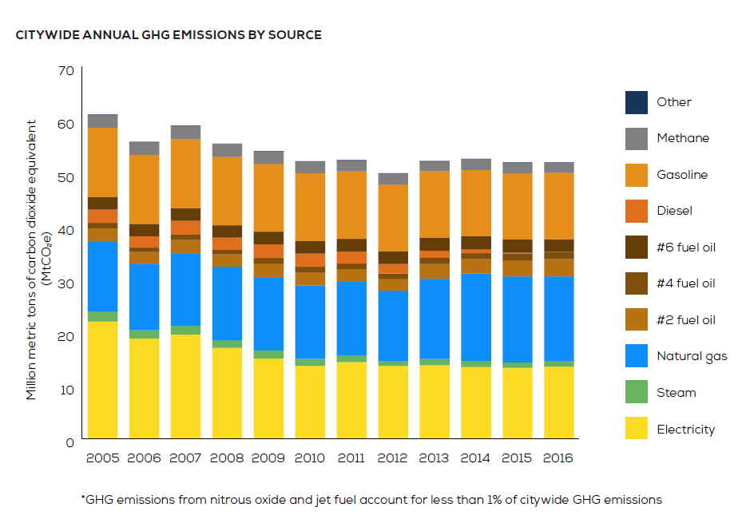
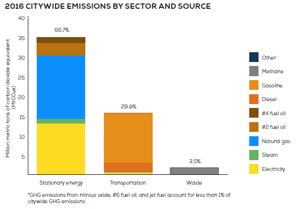

```{r setup, include=FALSE}
library(tidyverse)
library(sds192)
library(RMySQL)
library(leaflet)
library(sf)

db <- dbConnect(
  MySQL(), 
  host = "scidb.smith.edu", 
  user = "sds192", 
  password = "DSismfc@S", 
  dbname = "airlines"
)
knitr::opts_chunk$set(
  message = FALSE,
  echo = TRUE, 
  connection = db, 
  max.print = 20
)
```


## Introduction

  Have you wondered about the power of bicycles to fight climate change? 

 Last spring when a friend of mine at Smith told me that she wanted a car so she could have more independence, I immediately screamed inside myself thinking in the tons of carbon dioxide that that car would deliver to the environment in its lifespan.  I told her that she should wait to have a lot of money and buy an electric car instead or get a bicycle in the meantime. She laughed and seemed to agree. Our decisions today have a long and imperceptible effect especially when we talk about global warming and climate change.

 According to [NASA](https://climate.nasa.gov/causes/) there are several gases in the atmosphere trapping heat. One of those gases is carbon dioxide (CO2). This gas is released into the atmosphere through various natural processes and mostly, activities caused only by humans.  Deforestation and burning of fossil fuels are the primary drivers of carbon emissions. We have increased the levels of CO2 by 47% since the industrial revolution.

 Last year, in October, [Smith College divested from fossil fuels](https://www.smith.edu/president-kathleen-mccartney/letters/2019-20/fossil-fuels-and-smith-endowment ). The college voted to exclude Smith's endowment from any future investment with such industry. 
 This was a major victory for students who pressured for such change and for the community in general. It is a step we are convinced other colleges and universities will follow as well.

  Last year we also got acquainted with the eloquence and determination of a 17 year old Swiss red hair girl. I remember her clearly for her bold statement: “How dare you? You have stolen my dreams and my childhood with your empty words” (Greta Thunberg to World leaders- YouTube).
Greta Thunberg, an student and environmental activist, became the youngest and most outspoken critic of the lack of global policies to fight climate change. Perhaps the most heroic act we might remember about Ms. Thunberg is her decision to sail instead of flying from Europe to the United States to attend the 2019 UN Climate Action Summit. 

```{r, echo=FALSE}
library(vembedr)
 embed_url("https://www.youtube.com/watch?v=TMrtLsQbaok") %>% 
   use_start_time ("1m12") %>% 
   use_align ("center")
```


  What does all of that has to do with the citylike system in New York City and the data presented in this project? 

  According to a Greenhouse Gas emission report for NYC in 2016, 30% of the city emissions came from the transportation system. Cars are the largest generators of emission with 96% footprint. Cars powered with gasoline composed 80% of the transportation base emissions. See figures 1 and 2. [^1]

**Figure 1.** 



**Figure 2.**



  In this perspective, we could follow the example of the Netherlands, Denmark, the United Kingdom  and Germany that have incentivized the use of bicycles and discourage the use of cars by imposing heavy taxes on gasoline. Bikes can be used to reduce carbon emissions and mitigate climate change. Promoting the use of bicycles is essential to mitigate the effect of climate change and local government must facilitate adequate financial support.

## Our data:

Note : The data that we used was [citibikenyc](https://www.citibikenyc.com/system-data).  Trips made by staff members in their labor activities were removed as well as any trips lower than 60 second as they were false starts. 

  With our data we wanted to find the relationship between bike usage in NYC and weather temperature. Thus, this article will help us to determine whether age and gender are drivers for use the citibike system in New York and weather this could be a rationale tied to climate change perceptions. We also seek to expose the areas of higher confluence in the city for the use of these bikes.

 **Exploratory data analysis**

```{sql, connection=db, output.var = "Trips_during_school_year"}
SELECT duration, birth_year, gender, start_station_id FROM citibike.trips
WHERE duration > 600
AND user_type = 'subscriber'
AND stop_time < '2017-06-01#' OR start_time > '2017-09-01#';
```

  Our first step consisted in grouping those users younger than 30 and older than 30 to know which group uses the bike system more frequently.

```{sql connection=db, output.var = "Trips"}
SELECT duration, birth_year, gender
 FROM citibike.trips
WHERE duration > 600
AND user_type = 'subscriber';

```

```{r}
Trips_Age <- Trips %>% 
  mutate(age_category = ifelse(birth_year >= 1987, "Thirthy or Younger", "Older Than Thirty"))
```


  Having extracted the data from SQL, in our first graph we plotted it the total trips people of each age group took in 2017. We found that  older than 30-year old people use the systems more than 30-year old or younger. With people aged 25 and 32 being the group using the bike system more than 25 thousand trips a year.
  We were hoping to have more younger folks using the bike system since the common believe is that younger Americas worry about climate change more than older generations. In fact, a 2018 report by Gallup showed that because younger Americans are growing up with more exposure to the effects of Climate Change the polls often show that 70% of younger adults (ages 18-34) worry about global warming while people ages 55 and older worry less.[^2]
  Nevertheless scholar from Yale University also concluded that although it might seeem like younger Americans worry more about climate change, they dont always engage in activities to help mitigate their impacts. [^3]

```{r, warning=FALSE, fig.width=9, fig.height=7}
Trips_Age %>% 
  group_by(birth_year, age_category) %>% 
   summarize(total = sum(n())) %>%
  ggplot(aes(x = birth_year, y = total, fill= age_category)) + 
  geom_col()+
  scale_fill_manual(values = c("blue", "lightblue"))+
  xlim(c(1957, 2005))+
   labs (title = " Use of the Citibike System According to Age in 2017")+
  labs(y= "Total Trips", x= "Birth Year")+
  labs(fill= "Age Category")+
  theme(plot.title = element_text(colour = "black", hjust = 0.5, face = "bold"))+
  scale_y_continuous(labels = scales::comma)
 
```

  In our second graph we wanted to find out which gender is more likely to use the bike system in New York City independent of the age. Our coding displayed that men ride the public bikes more women.This results were unexpected since the general thought portrays women are more mindful of activities that help the environment. refer to this article by the Guardian.com [The eco gender gap: why is saving the planet seen as women’s work?](https://www.theguardian.com/environment/2020/feb/06/eco-gender-gap-why-saving-planet-seen-womens-work). In any way we thought that the fact that in NYC more men that women use the bike system has to do with other variables such outfit women wear and the type of jobs they hold without necessarily compromising their concern for climate change. However, this is just our opinion not proven scientifically.

```{r, fig.width=7, fig.height=5}
Trips %>% 
  group_by(birth_year, gender) %>% 
  filter(birth_year >= 1957, gender != 0) %>%
  mutate(gender = ifelse(gender == 1, "Male", "Female")) %>% 
  summarize(total = sum(n())) %>%
  ggplot(aes(x = birth_year, y = total, fill = gender)) + 
  geom_col()+
   scale_fill_manual(values =c("Pink", "lightblue"))+
  labs(title = "Gender Usage of the Bike System in 2017")+
  theme(plot.title = element_text(colour = "black", hjust = 0.4, face = "bold"))+
  labs(x= "Birth Year", y = "Total Trips")+
    labs(fill = "Gender")+
  scale_y_continuous(labels = scales::comma)
  
```


```{sql connection=db, output.var = "Trips"}
SELECT duration, birth_year, gender
 FROM citibike.trips
WHERE duration > 600
AND user_type = 'subscriber';

```


**Station Data**

```{sql connection=db, output.var = "months_station"}
SELECT station_id, name, num_starts, num_stops, avg_lat, avg_lon
 FROM citibike.station_months 
```

What stations get the most average rides (both starts and stops)?
Average numbers of trips per month:

```{r}
months_station_2 <- months_station %>% 
  #select(-station_id) %>% 
  mutate(trips = num_starts + num_stops) %>% 
  group_by(name) %>% 
  summarize(total_months = sum(n()),
            total_starts = sum(num_starts), 
          avg_trips = total_starts/total_months,
          avg_lat = first(avg_lat),
          avg_lon = first(avg_lon)
         )
```


```{r}
 Top_50_Stations <- months_station_2 %>%
 head(50) 
station_pal <- colorNumeric(
  palette = c("#FF9999", "#FF0000"), 
  domain = Top_50_Stations %>%
    pull(avg_trips) %>%
    range())

leaflet(Top_50_Stations) %>% 
  addTiles() %>%
  addCircles(lng = ~avg_lon, lat = ~avg_lat, weight = 3,
    radius = ~sqrt(avg_trips)*3,
    color = ~station_pal(avg_trips), popup = paste("<b>",Top_50_Stations$name, "</b>", "<br>",
                           "Average Number of Bicycles Used:", Top_50_Stations$avg_trips),opacity = 100)
```

# Weather Data

```{r}
weather_data <- read.csv("weather2017.csv")
```

```{r}
weather_data_long <- weather_data %>% pivot_longer(c(PRCP, SNOW), names_to = "prcp_type", values_to = "amount")

```

```{sql connection=db, output.var = "all_trips"}
SELECT CAST(start_time AS DATE) AS time
 FROM citibike.trips
```
 NOTE:  to convert the date data type I used resources https://www.essentialsql.com/datatype-conversion-in-sql-using-cast-and-convert/ and https://www.w3schools.com/sql/sql_datatypes.asp
 
[For the count and group by I used https://www.w3schools.com/sql/sql_groupby.asp] NO LONGER RELEVANT

AND stop_time < '2017-06-01#' OR start_time > '2017-09-01#';

```{r}
all_trips_grouped <- all_trips %>% 
  group_by(time) %>% 
  summarize(num_trips = n())
```

```{r}
trips_weather <- weather_data_long %>% 
  full_join(all_trips_grouped, by=c('DATE'='time')) 

trips_weather[is.na(trips_weather)] <- 0
```


```{r}
#Type & amount of precipiation
trips_weather %>% 
  filter(amount > 0) %>% 
  ggplot(aes(x = amount, y = num_trips, color = prcp_type)) + 
  geom_point() +
  scale_color_manual(values = c('green', 'deepskyblue'))
```

```{r}
#Temperature analysis
trips_weather %>% 
  group_by(DATE) %>% 
  mutate(total_prcp = sum(amount),
         Precipitation = case_when(total_prcp >= 2 ~ 'High',
                                   total_prcp >= 1 ~ 'Medium',
                                   total_prcp < 1 ~ 'Low'))%>% 
  ggplot(aes(x = TMAX, y = num_trips, color = Precipitation)) + 
  geom_point() +
  scale_color_manual(values = c('deeppink', 'darkgray', "blue"))
```
 case when from https://www.statology.org/conditional-mutating-r/

```{r}
trips_weather %>% 
  group_by(DATE) %>% 
  mutate(wind_speed = (WSF2/10)*2.2369)
  
```
  mutate(Wind = case_when(total_prcp >= 2 ~ 'High',
                                   total_prcp >= 1 ~ 'Medium',
                                   total_prcp < 1 ~ 'Low'))%>% 
  ggplot(aes(x = TMAX, y = num_trips, color = Precipitation)) + 
  geom_point() +
  scale_color_manual(values = c('deeppink', 'darkgray', "blue"))
```


## Analysis


What did you discover? 

## Conclusion

What did you *learn* about the data set your explored?  


---

## Word count

```{r word_count, message=FALSE, echo=FALSE}
sds192::text_stats()
```


## Standards

In this assignment, we are attempting the following standards:

```{r buttons, echo=FALSE}
standard_button("markdown")
standard_button("aesthetics")
standard_button("wrangling")
standard_button("context")
standard_button("reshape")
standard_button("relational")
standard_button("ethics")
standard_button("github")
standard_button("iteration")
standard_button("function")
standard_button("spatial")
standard_button("leaflet")
standard_button("query")
```

## References
[^1]: [Inventory of New York City Greenhouse Gas Emissions in 2016](https://www1.nyc.gov/assets/sustainability/downloads/pdf/publications/GHG%20Inventory%20Report%20Emission%20Year%202016.pdf)

[^2]: [Global Warming Age Gap: Younger Americans Most Worried](https://news.gallup.com/poll/234314/global-warming-age-gap-younger-americans-worried.aspx)

[^3]: [Do younger generations care more about global warming?](https://climatecommunication.yale.edu/publications/do-younger-generations-care-more-about-global-warming)
